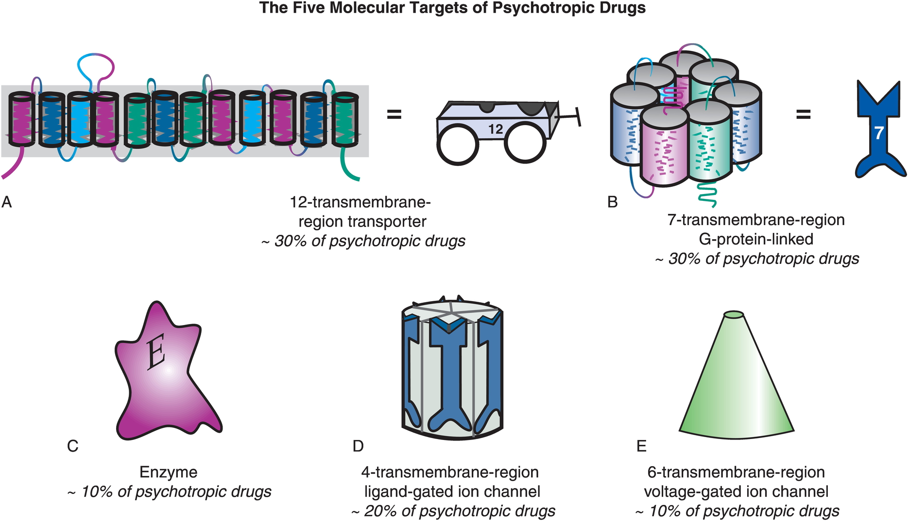

# Fun

<iframe width="420" height="315" src="https://www.youtube.com/embed/gsjcb7w1Y-w" frameborder="0" allowfullscreen></iframe>

# Neural communication

## What triggers the action potential?

- Soma receives input from dendrites (and on soma directly)
- Axon hillock sums/integrates
- If sum > threshold, action potential "fires"
- Action potential propagates along the axon

Source: https://commons.wikimedia.org/wiki/File%3A1224_Post_Synaptic_Potential_Summation.jpg

- Action potential's rapid change in voltage triggers neurotransmitter (NT) release

## Synaptic transmission

*Synapse* permits neuron to pass electrical or chemical messages to another neuron or target cell (muscle, gland, etc.) 

### Synapse Types

- Electrical
  - Gap junctions
  - *Cytosol* (and ionic current) flows through adjacent neurons 
- Chemical

Source: Blausen.com staff https://commons.wikimedia.org/wiki/File%3ABlausen_0843_SynapseTypes.png

### Steps in chemical transmission

- *Voltage-gated calcium Ca++ channels* open
- Ca++ influx causes *synaptic vesicles* to bind with presynaptic membrane, fuse with membrane, spill contents via *exocytosis*
- NTs diffuse across *synaptic cleft*
- NTs bind with *receptors* on *postsynaptic membrane*
  - Cause some post-synaptic effect
- NTs unbind from receptor
- NTs inactivated

Source: https://commons.wikimedia.org/wiki/File%3ASynapseSchematic_en.svg

### Exocytosis

Source: http://dx.doi.org/doi:10.1038/nrn2948

### Receptor/channel types

#### Leak/passive

- Vary in selectivity, permeability

#### Transporters/exchangers

+ Ionic
    * $Na^+$/$K^+$ ATP-ase/pump
+ Chemical
    * e.g., Dopamine transporter (DAT)

#### Ionotropic receptors (receptor + ion channel)

- Ligand-gated
- Open/close channel

#### Metabotropic receptors (receptor only)

- Triggers 2nd messengers
- G-proteins
- Open/close adjacent channels, change metabolism

### Receptors generate *postsynaptic potentials (PSPs)*

- Small voltage changes
- Amplitude scales with # of receptors activated
- *Excitatory PSPs (EPSPs)*
    + Depolarize neuron (make more +)
- *Inhibitory (IPSPs)*
    + Hyperpolarize neuron (make more -)

### NTs inactivated

- Buffering
    + e.g., glutamate into astrocytes
- Reuptake into presynaptic cell via transporters
    + e.g., serotonin via serotonin transporter (SERT)
- Enzymatic degradation
    + e.g., acetylcholine esterase (AChE) degrades acetylcholine (ACh)

### Questions to ponder

- Why do NTs diffuse from pre- to post-synaptic membrane?
- Why must NTs be inactivated?
- What sort of PSP would *opening* a Na+ channel produce?
- What sort of PSP would *opening* a Cl- channel produce?
- What sort of PSP would *closing* a K+ produce?

### Synapse location and function

- dendrites
    + usually excitatory 
- cell bodies
    + usually inhibitory 
- axons 
    + usually modulatory (change p(fire))

## Neurotransmitters

| Family      | Neurotansmitter                     |
|-------------|-------------------------------------|
| Amino acids | [Glutamate](https://en.wikipedia.org/wiki/Glutamate_(neurotransmitter))                           |
|             | [$\gamma$ aminobutyric acid (GABA)](https://en.wikipedia.org/wiki/Gamma-Aminobutyric_acid)      |
|             | Glycine                             |
|             | Aspartate                           |

### Glutamate

- Primary excitatory NT in CNS
- Role in learning (via NMDA)
- Receptors on neurons and glia (astrocytes and oligodendrocytes)
- Linked to umami (savory) taste sensation (think monosodium glutamate or MSG)
- Dysregulation in schizophrenia? [[@javitt2010glutamatergic]](http://search.proquest.com/openview/b3f476465105142b104ba03c9c9b490c/1?pq-origsite=gscholar)

| Type         | Receptor   | Esp Permeable to |
|--------------|------------|------------------|
| Ionotropic   | AMPA       | Na+, K+          |
|              | Kainate    |                  |
|              | NMDA       | Ca+              |
| Metabotropic | mGlu       |                  |

### $\gamma$ aminobutyric acid (GABA)

- Primary inhibitory NT in CNS
- Excitatory in developing CNS, [Cl-] in >> [Cl-] out
- Binding sites for benzodiazepines (BZD; e.g., Valium), barbiturates, ethanol, etc.
    - BZD affect subset of GABA-A receptors
    - Increase total Cl- influx

| Type         | Receptor   | Esp Permeable to |
|--------------|------------|------------------|
| Ionotropic   | GABA-A     | Cl-              |
| Metabotropic | GABA-B     | K+                 |

Source: https://commons.wikimedia.org/wiki/File:GABAA-receptor-protein-example.png#/media/File:GABAA-receptor-protein-example.pn

### Other amino acid NTs

- *Aspartate*
    + Like Glu, stimulates NMDA receptor
- *Glycine*
    + Spinal cord interneurons

### Acetylcholine (ACh)

- Primary excitatory NT of CNS output
- Somatic nervous system (motor neuron -> neuromuscular junction)
- Autonomic nervous system (ANS)
    + Sympathetic branch: preganglionic neuron
    + Parasympathetic branch: pre/postganglionic
    

Source: http://myzone.hrvfitltd.netdna-cdn.com/wp-content/uploads/2014/09/Image-1.jpg

| Type         | Receptor           | Esp Permeable to | Blocked by       |
|--------------|--------------------|------------------|------------------|
| Ionotropic   | Nicotinic (nAChR)  | Na+, K+          | e.g., Curare     |
| Metabotropic | Muscarinic (mAChR) | K+               | e.g., Atropine   |

### Curare

### Atropine

- aka, nightshade or belladonna
- inhibits (acts as an antagonist for) muscarinic ACh receptor

https://cdn.britannica.com/92/183192-050-1741C2F9/Belladonna-nightshade-leaves-berries-alkaloids-humans.jpg

Source: https://commons.wikimedia.org/wiki/File:Eye_treated_with_dilating_eye_drops.jpg

## Monoamine NTs

| Family      | Neurotransmitter                         |
|-------------|-----------------------------------------|
| Monoamines  | Dopamine (DA)                           |
|             | Norepinephrine (NE)/Noradrenaline (NAd) |
|             | Epinephrine (Epi)/Adrenaline (Ad)       |
|             | Serotonin (5-HT)                        |
|             | Melatonin                               |
|             | Histamine                               |

### Information processing

- Point-to-point
    + One sender, small number of recipients
    + Glu, GABA
- Broadcast
    + One sender, widespread recipients
    + DA, NE, 5-HT, melatonin, histamine
- Need to know
    + NT, where projecting, type of receptor to predict function

### Dopamine

- Released by
    + Substantia nigra -> striatum, *meso-striatal projection*
    + Ventral tegmental area (VTA) -> nucleus accumbens, ventral striatum, hippocampus, amygdala, cortex; *meso-limbo-cortical projection*

Source: http://thebrain.mcgill.ca/flash/a/a_03/a_03_cl/a_03_cl_que/a_03_cl_que_1a.gif

Clinical relevance for

- Parkinson's Disease (mesostriatal)
    + DA agonists treat (agonists facilitate/increase transmission)
- ADHD (mesolimbocortical)
- Schizophrenia (mesolimbocortical)
    + DA antagonists treat
- Addiction (mesolimbocortical)

Inactivated via

- Chemical breakdown (e.g., via monoamine oxidase), <http://www.scholarpedia.org/article/Dopamine_anatomy#Dopamine_receptors>
- Dopamine transporter (DAT)
  - Psychostimulants (e.g., cocaine, methylphenidate) act upon. [[@noauthor_undated-on]](https://www.sciencedirect.com/topics/neuroscience/dopamine-transporter)
  - DAT also transports norepinephrine (NE)

https://ars.els-cdn.com/content/image/3-s2.0-B9780123741059002379-gr1.jpg?_

| Type         | Receptor             | Comments                      |
|--------------|----------------------|-------------------------------|
| Metabotropic | D1-like (D1 and D5)  | more prevalent                |
|              | D2-like (D2, D3, D4) | target of many antipsychotics |

### Norepinephrine

- Released by
    + *[locus coeruleus](http://www.scholarpedia.org/article/Locus_coeruleus)* in pons/caudal tegmentum
    + postganglionic sympathetic neurons onto target tissues
    
    

    
    
https://upload.wikimedia.org/wikipedia/commons/thumb/c/cd/Locus_coeruleus_highlighted.jpg/300px-Locus_coeruleus_highlighted.jpg

    

https://www.researchgate.net/publication/338194613/figure/fig1/AS:842586742857728@1577899742543/Locus-coeruleus-LC-efferent-pathways-and-relevant-functions-LC-projects-throughout-the.png

Source: http://myzone.hrvfitltd.netdna-cdn.com/wp-content/uploads/2014/09/Image-1.jpg

    
- Role in arousal, mood, eating, sexual behavior
- Clinical relevance for ADHD, Alzheimer's, Parkinson's, depression
- Inactivated by norepinephrine transporter (NET), aka noradrenaline transporter (NAT)
    - Contributes to DA uptake, too.
- Also monoamine oxidase inhibitors (MAOIs)
    + inactivate monoamines in neurons, astrocytes
    + MAOIs increase NE, DA
    + Treatment for depression

Source: https://www.dartmouth.edu/~rswenson/NeuroSci/figures/Figure_9_files/image002.jpg

| Type         | Receptor             | Comments                           |
|--------------|----------------------|------------------------------------|
| Metabotropic | $\alpha$ (1,2)         | antagonists treat anxiety, panic   |
|              | $\beta$ (1,2,3)        | 'beta blockers' in cardiac disease |

### Adrenaline/Epinephrine

- Synthesized from norepinephrine
- As NT: Released in small amounts by medulla oblongata
- As hormone: Released by adrenal medulla
- Binds to ($\alpha_{1,2}$, $\beta_{1,2,3}$ receptors in blood vessels, cardiac muscle, lungs, eye muscles controlling pupil dilation, liver, pancreas, etc.
- Release enhanced by cortisol from adrenal cortex
- Unusual in NOT being part of negative feedback system controlling its own release

### Serotonin (5-HT)

- Released by *raphe nuclei* in brainstem
- Role in mood, sleep, eating, pain, nausea, cognition, memory
- Modulates release of other NTs
- Most of body's 5-HT regulates digestion

Source: https://www.dartmouth.edu/~rswenson/NeuroSci/figures/Figure_9_files/image002.jpg

- Separate cortical, subcortical 5-HT projection pathways?

[[@Ren2018-zl]](http://dx.doi.org/10.1016/j.cell.2018.07.043)

- Seven receptor families (5-HT 1-7) with 14 types
- All but one metabotropic

Clinically significant because

- Ecstasy (MDMA) disturbs serotonin
- So does LSD
- Fluoxetine (Prozac)
    + *Selective Serotonin Reuptake Inhibitor (SSRI)*
    + Treats depression, panic, eating disorders, others
- 5-HT3 receptor antagonists are anti-mimetics used in treating nausea

### Melatonin

- Released by pineal gland (pine cone-like appearance)

http://www.vivo.colostate.edu/hbooks/pathphys/endocrine/otherendo/pinealgland.jpg

### Histamine

- Released by hypothalamus, projects to whole brain
- $H_1$-$H_4$ Metabotropic receptors, one ionotropic type in thal/hypothal
- Role in arousal/sleep regulation
- In body, part of immune/inflammatory response

## Targets of psychotropic drugs

Source: https://stahlonline.cambridge.org/essential_4th_chapter.jsf?page=chapter2_summary.htm&name=Chapter%202&title=Summary

## Other NTs

- Gases
    + *Nitric Oxide (NO)*, *carbon monoxide (CO)*
- Neuropeptides
    + *Substance P* and *endorphins* (endogenous morphine-like compounds) have role in pain
    + *Orexin/hypocretin*, project from lateral hypothalamus across brain, regulates appetite, arousal
    + *Cholecystokinin (CCK)* stimulates digestion
- Purines
    + *Adenosine* (inhibited by caffeine)
- Others
    + *Anandamide* (activates endogenous cannabinoid receptors)

# Hormonal communication

- Chemicals secreted into blood
- Act on specific target tissues via receptors
- Produce specific effects

## Examples of substances that are both hormones and NTs
    
- Melatonin
- Epinephrine/adrenaline
- Oxytocin
- Vasopressin
    
## Behaviors under hormonal influence

### Ingestive (eating/ drinking)

+ Fluid levels
+ Na, K, Ca levels 
+ Digestion
+ Blood glucose levels

### Reproduction-related

+ Sexual Maturation
+ Mating
+ Birth
+ Care giving

### To threat/challenge

+ Metabolism
+ Heart rate, blood pressure 
+ Digestion
+ Arousal

### Common factors

- Biological imperatives
- Proscribed in space and time
- Foraging/hunting
    + Find targets distributed in space, evaluate, act upon
- Often involve others

## Principles of hormonal action

- Gradual action
- Change intensity or probability of behavior 
- Behavior influences/influenced by hormones
    + +/- Feedback
- Multiple effects on different tissues
- Produced in small amounts; released in bursts 
- Levels vary daily, seasonally
    + or are triggered by specific external/internal events
- Effect cellular metabolism 
- Influence only cells with receptors
- Point to point vs.“broadcast”
    + Wider broadcast than neuromodulators
- Fast vs. slow-acting
- Short-acting vs. long-acting
- Digital (yes-no) vs. analog (graded) 
- Voluntary control vs. involuntary

### Similarities between neural and hormonal communication

- Chemical messengers stored for later release 
- Release follows stimulation
- Action depends on specific receptors
- 2nd messenger systems common

### Hormonal release sites

- CNS
    + Hypothalamus
    + *Pituitary*
        * *Anterior*
        * *Posterior*
    + Pineal gland
- Rest of body
    + *Thyroid*
    +  *Adrenal (ad=adjacent, renal=kidney) gland*
        * *Adrenal cortex*
        * *Adrenal medulla*
    + *Gonads* (testes/ovaries)

## Two release systems from hypothalamus 

### Direct release

- Hypothalamus (paraventricular, supraoptic nucleus) to
- Posterior pituitary
    + *Oxytocin*
    + *Arginine Vasopressin (AVP, vasopressin)*
        

Source: https://upload.wikimedia.org/wikipedia/commons/thumb/7/70/1807_The_Posterior_Pituitary_Complex.jpg/594px-1807_The_Posterior_Pituitary_Complex.jpg

### Indirect release

- Hypothalamus -> *releasing hormones* 
- Anterior pituitary -> *tropic hormones*
- End organs

## Case studies

### Responses to threat or challenge

- Neural response
    + *Sympathetic Adrenal Medulla (SAM) response*
    + Sympathetic NS activation of adrenal medulla, other organs
    + Releases NE and Epi into bloodstream
  

[[@ulrich-lai_neural_2009]](http://doi.org/10.1038/nrn2647)

- Endocrine response
    + *Hypothalamic Pituitary Adrenal (HPA) axis*
    + Adrenal hormones released
- Hypothalamus
    + *Corticotropin Releasing Hormone (CRH)*
- Anterior pituitary
    + *Adrenocorticotropic hormone (ACTH)*
- Adrenal cortex
    + *Glucocorticoids (e.g., cortisol)*
    + *Mineralocorticoids (e.g. aldosterone)*
    

[[@ulrich-lai_neural_2009]](http://doi.org/10.1038/nrn2647)

#### Adrenal hormones

- *Steroids*
    + Derived from cholesterol
- *Cortisol*
    + increases blood glucose, anti-inflammatory effects
    + negative consequences of prolonged exposure 
- *Aldosterone*
    + Regulates Na (and water)
    
### Reproductive behavior -- the milk letdown reflex

- Supraoptic & Paraventricular nucleus (PVN) of hypothalamus releases oxytocin 
    - Into bloodstream via posterior pituitary (endocrine)
    - Onto neurons in nucleus accumbens (neurocrine), amygdala, brainstem
- Oxytocin stimulates milk ducts to secrete

https://64.media.tumblr.com/29ad3be13cc42500c5c0eb496b465745/tumblr_nr55r27dOB1tqg84mo1_640.png

**Oxytocin's role...**

- Sexual arousal
- Released in bursts during orgasm
- Stimulates uterine, vaginal contraction during labor
    - But mouse OXY knock-out model still engages in reproductive behavior and gives birth without incident.
- Oxytocin cells in ovarian corpus luteum, testicles, retina, adrenal medulla, pancreas
- Links to social interaction, bonding  [[@Weisman2013158]](http://dx.doi.org/10.1016/j.biopsych.2013.05.026)
- Alters face processing in autism  [[@Domes2013164]](http://dx.doi.org/10.1016/j.biopsych.2013.02.007)
- May inhibit fear/anxiety-related behaviors by gating amygdala [[@viviani2011oxytocin]](http://doi.org/10.1126/science.1201043)

### Circadian rhythms

#### Melatonin

- Diurnal rhythm
- Night time peak, early morning low
- Secretion suppressed by short wavelength or "blue" light (< 460-480 nm)
- Rhythm irregular until ~3 mos post-natal [[@Ardura2003-tw]](http://dx.doi.org/68571)
- Peak weakens, broadens with age

- Suprachiasmatic nucleus (SCN) of the hypothalamus
- Paraventricular nucleus of the hypothalamus
- Spinal cord
- Superior cervical ganglion
- Pineal gland

<iframe width="560" height="315" src="https://www.youtube.com/embed/fgJPnQCJ9eE" frameborder="0" allowfullscreen></iframe>

## Thinking about neurochemical influences

- Measure hormones in blood, saliva; can't effectively measure NTs
- Multivariate, nonlinear, mutually interacting
- Varied time scales
    - Phasic (e.g., cortisol in response to challenge)
    - Periodic (e.g., melatonin; diurnal cortisol)
- Peripheral effects + neural feedback
- State variables and behavior
    - Are your participants sleepy, hungry, horny, distressed...
    - Endogenous & exogenous influences
    - Systems interact; need better, broader, and denser measurement

### Gut/brain connection

[[@Sarkar2016-qf]](https://doi.org/10.1016/j.tins.2016.09.002)

# References
