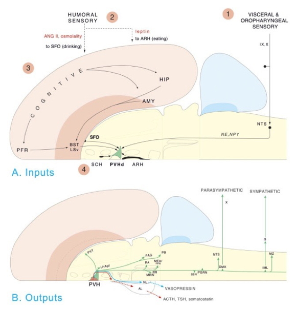

# The emergence of complex behavior

## Cambrian Explosion

<iframe width="800" height="450" src="https://www.youtube.com/embed/qNtQwUO9ff8" frameborder="0" allowfullscreen></iframe>

## Sparked by behavioral imperatives?  [[@fox_what_2016]](http://doi.org/10.1038/530268a)

- Behavior requires energy
- Behavior requires perception at a distance
- Behavior requires action
- Actions require
    - Problem solving, (sequence) planning
    - Current + stored information (memory)

### Behaviors realized through...

- Perception at a distance of what/where
- Locomotion
    - Approach/avoid/explore
- Object manipulation/consumption
- Signaling/communication
- Physiological regulation

## Complex behavior ~ Nervous systems

http://larrywswanson.com

http://larrywswanson.com

http://larrywswanson.com

[[@swanson2005anatomy]](http://dx.doi.org10.1002/cne.20733)

[[@swanson2005anatomy]](http://dx.doi.org10.1002/cne.20733)

[[@swanson2012brain]](https://books.google.com/books?hl=en&lr=&id=tAk8Rr00kykC&oi=fnd&pg=PP2&dq=larry+swanson+book&ots=5F7nEnts45&sig=DJLKh5BF_8aVqpOdK28Qmh1wr5Q#v=onepage&q=larry%20swanson%20book&f=false)

# Cognition

Combines...

- Perception
- Attention
- Imagery
- Learning and conditioning
- Memory
    + Episodic (events)
    + Semantic (facts, things, entities)
    + Procedural (actions)
- Problem-solving
- Language

## Cognition and the cerebral cortex

[[@swanson2012brain]](https://books.google.com/books?hl=en&lr=&id=tAk8Rr00kykC&oi=fnd&pg=PP2&dq=larry+swanson+book&ots=5F7nEnts45&sig=DJLKh5BF_8aVqpOdK28Qmh1wr5Q#v=onepage&q=larry%20swanson%20book&f=false)

### Macrostructure

- Areas
    + Unimodal sensory
    + Polymodal association
    + Motor
- Connections
    + Association
    + Commissural

[[@swanson2012brain]](https://books.google.com/books?hl=en&lr=&id=tAk8Rr00kykC&oi=fnd&pg=PP2&dq=larry+swanson+book&ots=5F7nEnts45&sig=DJLKh5BF_8aVqpOdK28Qmh1wr5Q#v=onepage&q=larry%20swanson%20book&f=false)

### Microstructure

- Columnar structure
- Cytoarchitectonic differerences (e.g. Brodmann)

Wikipedia

| Layer | Connection type | Comments |
|-------|-----------------|----------|
| I     |                 | Few cell bodies         |
| II    | Efferent  | Ipsilateral association via large pyramidal cells |
| III   | Efferent        | Contralateral commissural |
| IV    | Afferent        | from thalamus; small stellate & granual cells; V1 has sublayers |
| V     | Efferent        | Superficial -> Basal ganglia; Deep -> brainstem, spinal cord; pyramidal cells |
| VI    | Efferent        | Thalamus |
    

[[@swanson2012brain]](https://books.google.com/books?hl=en&lr=&id=tAk8Rr00kykC&oi=fnd&pg=PP2&dq=larry+swanson+book&ots=5F7nEnts45&sig=DJLKh5BF_8aVqpOdK28Qmh1wr5Q#v=onepage&q=larry%20swanson%20book&f=false)

[[@swanson2012brain]](https://books.google.com/books?hl=en&lr=&id=tAk8Rr00kykC&oi=fnd&pg=PP2&dq=larry+swanson+book&ots=5F7nEnts45&sig=DJLKh5BF_8aVqpOdK28Qmh1wr5Q#v=onepage&q=larry%20swanson%20book&f=false)

[[@swanson2005anatomy]](http://dx.doi.org10.1002/cne.20733)

[[@swanson2005anatomy]](http://dx.doi.org10.1002/cne.20733)

[[@swanson2005anatomy]](http://dx.doi.org10.1002/cne.20733)

[[@swanson2005anatomy]](http://dx.doi.org10.1002/cne.20733)

### Processing networks

>"*Although it has long been assumed that cognitive functions are attributable to the isolated operations of single brain areas, we demonstrate that the weight of evidence has now shifted in support of the view that cognition results from the dynamic interactions of distributed brain areas operating in large-scale networks....*"

[[@bressler2010large]](http://dx.doi.org/10.1016/j.tics.2010.04.004)

[[@bressler2010large]](http://dx.doi.org/10.1016/j.tics.2010.04.004)

[[@bressler2010large]](http://dx.doi.org/10.1016/j.tics.2010.04.004)

[[@bressler2010large]](http://dx.doi.org/10.1016/j.tics.2010.04.004)

[[@bressler2010large]](http://dx.doi.org/10.1016/j.tics.2010.04.004)

## Summing up

- Cognition controls
    + Do what, where, when, and how
- The "cognitive" cortex
- Processing networks
    + Functional specialization
    + Dynamic interaction
    + Nested feedback control loops
    

[@Powers1973-zn]

[@Powers1973-zn]

# Language and the brain

## Language behavior

<iframe width="800" height="450" src="https://www.youtube.com/embed/4X4Fy8YqysY?rel=0&amp;start=160" frameborder="0" allowfullscreen></iframe>

- Productive
    - Speaking (2-5 words/s), modulate prosody, often combined with gesture
    - Writing, typing (.5-1.5 words/s)
- Receptive
    - Listening, responding (facial expressions, gestures, laughter, etc.)
    - Reading (3-5 words/s)
- How so fast? Time for feedback?

## Hierarchical structure of language information

- Phonetic
    - |Ber| |wiTH| |mē|
- Syntactic
- Semantic

- Pragmatic

## Wernicke-Geschwind (WG) model

- [Carl Wernicke](https://en.wikipedia.org/wiki/Carl_Wernicke)
- [Norman Geschwind](https://en.wikipedia.org/wiki/Norman_Geschwind)
- Perception ≠ production

Wikipedia

### Wernicke's area (Brodmann Area or BA 42)
    
- Adjacent to primary auditory cortex (A1; Heschl's gyrus; BA 41)
- Perception
- Receptive or 'fluent' aphasia

Wikipedia

Wikipedia

<iframe width="800" height="450" src="https://www.youtube.com/embed/dKTdMV6cOZw?rel=0" frameborder="0" allowfullscreen></iframe>

### Broca's area

- Inferior frontal gyrus, pars opercularis (BA 44) & pars angularis (BA 45)     
- Production
- Expressive aphasia

Wikipedia

<iframe width="560" height="315" src="https://www.youtube.com/embed/f2IiMEbMnPM" frameborder="0" allowfullscreen></iframe>

## Dual streams [[@Hickok2007-rc]](http://doi.org/10.1038/nrn2113)

- Ventral (speech signals -> semantics)
- Dorsal (speech signal acoustics -> articulatory networks in frontal lobe)

[[@Hickok2007-rc]](http://doi.org/10.1038/nrn2113)

### Metaanalytic evidence [[@Hagoort2014-au]](http://doi.org/10.1146/annurev-neuro-071013-013847)

[[@Hagoort2014-au]](http://doi.org/10.1146/annurev-neuro-071013-013847)

[[@Hagoort2014-au]](http://doi.org/10.1146/annurev-neuro-071013-013847)

[[@Hagoort2014-au]](http://doi.org/10.1146/annurev-neuro-071013-013847)

---

>"*A meta-analysis of numerous neuroimaging studies reveals a clear dorsal/ventral gradient in both left inferior frontal cortex and left posterior temporal cortex, with dorsal foci for syntactic processing and ventral foci for semantic processing. In addition...further networks need to be recruited to realize language-driven communication to its full extent.*"

[[@Hagoort2014-au]](http://doi.org10.1146/annurev-neuro-071013-013847)

## Summing up

- WG model incomplete, simplistic
    - Broca's not just production; Wernicke's not just perception
    - Beyond single words...
- Rapid, fluent comprehension and production of language relies on
    - Distributed temporal/frontal networks
    - Efficient bottom-up and top-down processing
    - Syntactic vs. semantic/articulatory processing

[[@Hagoort2014-au]](http://doi.org10.1146/annurev-neuro-071013-013847)

# References
