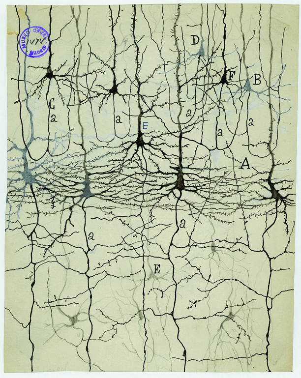
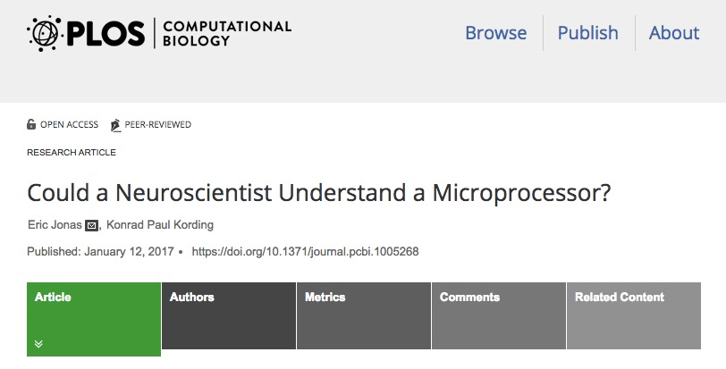

# Neuroscience methods

## Evaluating methods 

### What are we measuring?

- Structure
- Activity
    - Why not *function*?

### What is the question?

- Structure X -> Structure Y
- Structure X -> Function Y

## Evaluating methods

### Strengths & Weaknesses

- Cost
- Invasiveness
- Spatial/temporal resolution

## Spatial resolution {.flexbox .vcenter}

<http://ai.ato.ms/MITECS/Images/churchland.figure1.gif>

## ...and temporal resolution {.flexbox .vcenter}

[[@sejnowski2014putting]](http://doi.org/10.1038/nn.3839)

## Types of methods

### Structural 

- Anatomy
- Connectivity/connectome

### Functional (next time)

- What does it do?
- Physiology/Activity

## Mapping structures

- Cell/axon stains
- Cellular distribution, concentration, microanatomy

### **Golgi stain** -- whole cells, but small %

<http://connectomethebook.com/wp-content/uploads/2011/11/Brainforest17_1119.jpg>

---

Here's a pretty one of the hippocampus.

---

<http://wam.umn.edu/calendar/cajal/>

And here is one from Santiago Ramon y Cajal.

#### [Camillo Golgi](https://en.wikipedia.org/wiki/Camillo_Golgi)

### **Nissl stain**: Only cell bodies

Here's a Nissl-stained section of the macaque brain. It stains only cell bodies, but the density of staining tells us where there are lots of cells and where there are fewer.

#### [Franz Nissl](https://en.wikipedia.org/wiki/Franz_Nissl)

## [Brainbow](http://cbs.fas.harvard.edu/science/connectome-project/brainbow)

[[@lichtman_technicolour_2008]](http://doi.org/10.1038/nrn2391)

## Brainbow

[[@lichtman_technicolour_2008]](http://doi.org/10.1038/nrn2391)

## [Clarity](http://clarityresourcecenter.com/CLARITY.html)

<iframe width="560" height="315" src="https://www.youtube.com/embed/c-NMfp13Uug" frameborder="0" allowfullscreen></iframe>

## Evaluating cellular techniques

- Invasive (in humans post-mortem only)
- High *spatial* resolution, but poor/coarse *temporal*
    - Why?

## Mapping structures

- **Computed axial tomography (CAT), CT**
- X-ray based

---

<http://img.tfd.com/mk/T/X2604-T-22.png>

## Tomography {.flexbox .vcenter}

<http://static.howstuffworks.com/gif/cat-scan-pineapple.jpg>

---

<!-- https://medium.com/datadriveninvestor/detecting-brain-hemorrhage-in-computed-tomography-ct-imaging-d1276cb6bdb7 -->

<small>
<https://medium.com/datadriveninvestor/detecting-brain-hemorrhage-in-computed-tomography-ct-imaging-d1276cb6bdb7>
</small>

Here's a CT image of two brains, the one on the right has an intracerebral hemorrhage.

## **Magnetic Resonance Imaging (MRI)**

- Magnetic resonance a property of some isotopes and complex molecules
- Hydrogen ($H$), common in water & fat, is one
- In magnetic field, $H$ atoms absorb and release radio frequency (RF) energy
- $H$ atoms align with strong magnetic field

---

- Applying RF pulse perturbs alignment
- Rate/timing of realignment varies by tissue
- Realignment gives off radio frequency (RF) signals
- Strength of RF ~ density of $H$ (or other target)
- K-space (frequency/phase) -> anatomical space

## MRI {.flexbox .vcenter}

<http://s.hswstatic.com/gif/mri-steps.jpg>

## **Structural MRI**

- Tissue density/type differences
- **Gray matter** (nerve cells & **dendrites**) vs. **white matter** (**axon fibers**)
- **Spectroscopy** (specific metabolites)
- Region sizes/volumes

---

Here is an illustration of the different slices of an image sequence.

---

Here's an example of MR spectroscopy showing the concentrations of several different metabolites in a large voxel of brain tissue.

## **Voxel-based morphometry (VBM)**

Volume differences in schizophrenic patients vs. controls
 

[[@Pomarol-Clotet2010-tq]](https://dx.doi.org/10.1038/mp.2009.146)

And here's an illustration of the use of morphometric techniques. The colored portions are statistical maps placed on top of a base structural map. The statistical maps provide information about the comparison in brain volumes between patients and controls in those areas.

## What is the wiring diagram ("connectome")?

The idea is analogous to electronics. We want the schematic. Without the schematic, we can't really tell what the thing does.

---

## Retrograde (output -> input) vs. anterograde (input -> output) tracers

<http://openi.nlm.nih.gov/imgs/512/348/3176268/3176268_1471-2105-12-351-2.png>

---

<iframe width="560" height="315" src="https://www.youtube.com/embed/nvXuq9jRWKE" frameborder="0" allowfullscreen></iframe>

## **Diffusion Tensor Imaging (DTI)**

- Structural MRI technique
- Diffusion tensor: measurement of spatial pattern of $H_2O$ diffusion in small volume
- Uniform ("isotropic") vs. non-uniform ("anisotropic")
- Strong anisotropy suggests large # of axons with similar orientations (fiber tracts)

---

Here's an illustration of what a tensor looks like. You can see an isotropic and an anisotropic tensor.

---

## Connectome as matrix

---

## Main points

- Understanding brain/behavior relations requires a diverse toolkit
    - Structural vs. functional methods
    - Spatial and temporal resolution
    - Invasive vs. non-

## References {.smaller}
