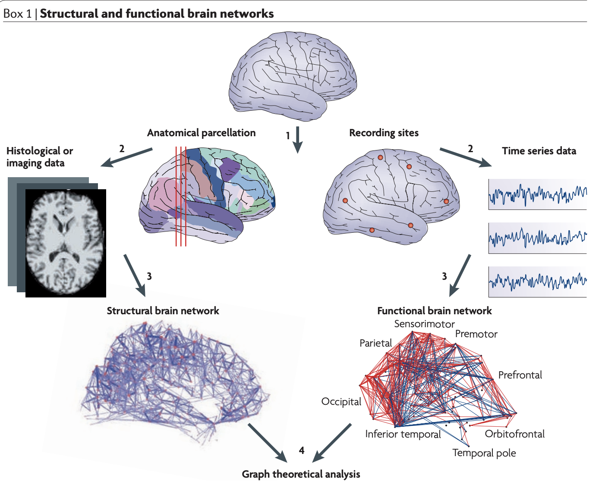
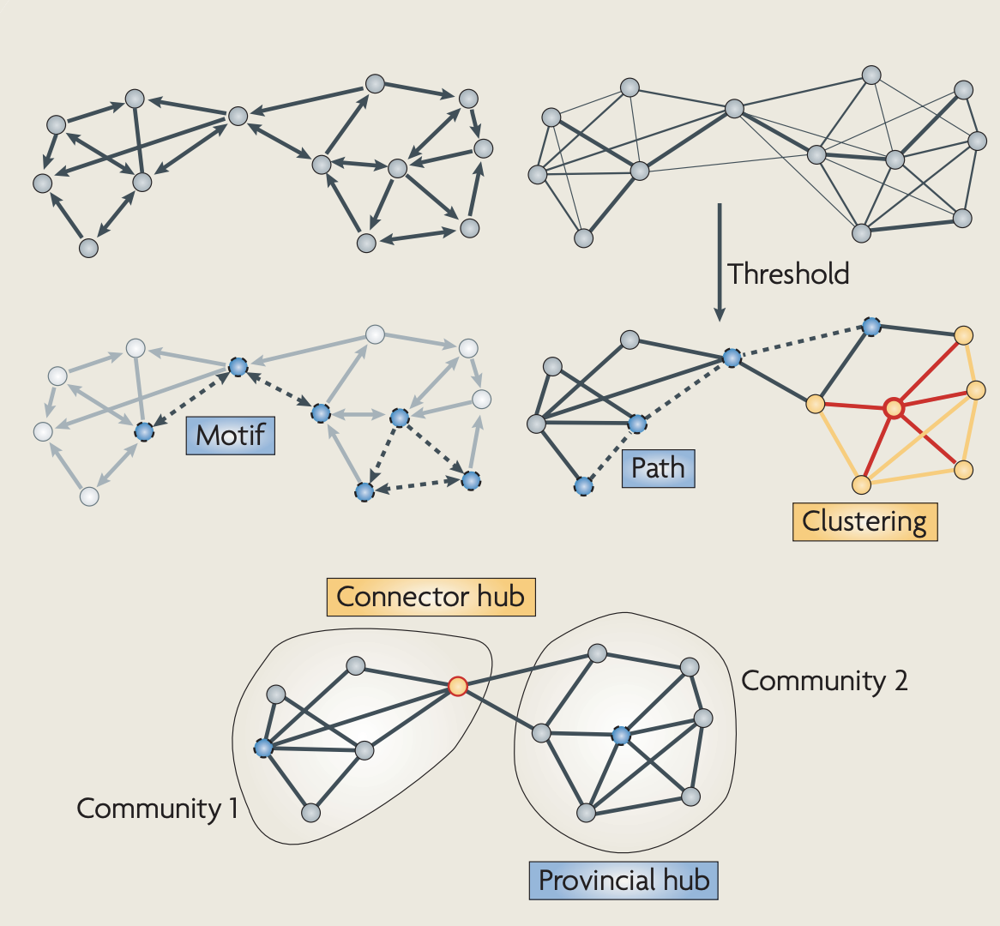
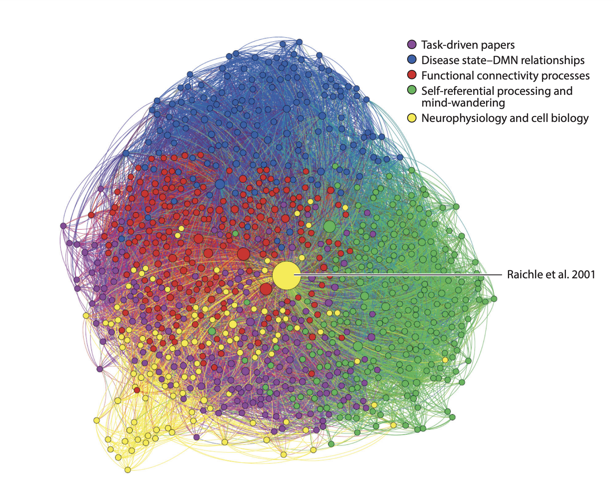
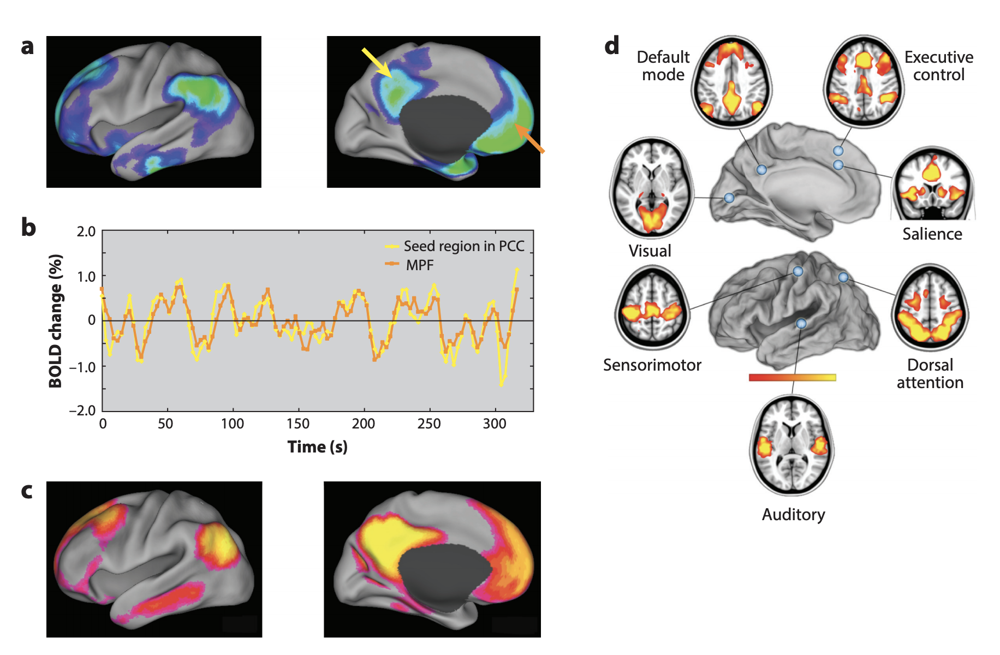

# Networks

## Graph theory

- Graphs: mathematical structures of pairwise relations
    - Nodes (vertices)
    - Edges
- Directed vs. undirected
- Measures of [[@Bullmore2009-mx]](Bullmore2009-mx)
    - Node degree, degree distribution, assortativity
    - Clustering coefficient & motifs
    - Path-length & efficiency
    - Connection density & cost
    - Hubs, centrality, & robustness
    - Modularity

 By &lt;a href="//commons.wikimedia.org/wiki/User:SlvrKy" title="User:SlvrKy"&gt;Martin Grandjean&lt;/a&gt; - &lt;span class="int-own-work" lang="en"&gt;Own work&lt;/span&gt;, <a href="https://creativecommons.org/licenses/by-sa/4.0" title="Creative Commons Attribution-Share Alike 4.0">CC BY-SA 4.0</a>, <a href="https://commons.wikimedia.org/w/index.php?curid=39967994">Link</a>

## Graph theory in neuroscience

### How to

[[@Bullmore2009-mx]](Bullmore2009-mx)

>*Structural and functional brain networks can be explored using graph theory through the following four steps (see the figure): 1) Define the network nodes. These could be defined as electroencephalography or multielectrode-array electrodes, or as anatomically defined regions of histological, MRI or diffusion tensor imaging data. 2) Estimate a continuous measure of association between nodes. This could be the spectral coherence or Granger causality measures between two magnetoencephalography sensors, or the connection probability between two regions of an individual diffusion tensor imaging data set, or the inter-regional correlations in cortical thickness or volume MRI measurements estimated in groups of subjects. 3) Generate an association matrix by compiling all pairwise associations between nodes and (usually) apply a threshold to each element of this matrix to produce a binary adjacency matrix or undirected graph. 4) Calculate the network parameters of interest in this graphical model of a brain network and compare them to the equivalent parameters of a population of random networks.*

[[@Bullmore2009-mx]](Bullmore2009-mx)

### Examples

Figure 1: Computational modelling of structural and functional brain networks.

[[@Bullmore2009-mx]](Bullmore2009-mx)

>*Computational models have been used to demonstrate how dynamic patterns arise as a result of interactions between anatomically connected neural units. Shown is how such a model is generated and used. A structural brain network derived from anatomical data serves as a matrix of coupling coefficients that link neuronal nodes, the activities of which unfold through time. This time evolution is governed by physiologically motivated dynamic equations. In the example shown, the surface of the macaque cortex was subdivided into 47 areas (nodes) and a structural brain network linking these nodes was compiled from anatomical tract-tracing data. The dynamic equations were derived from a model of large neuronal populations, the parameters of which were set to physiological values 109. Data from computer simulations then yield functional brain networks. Such networks are derived from measures of association between the simulated time series — for example, an information theoretic measure such as the mutual information (computed on voltage–time data) or cross-correlations in neural activity that are computed from simulated blood oxygen level-dependent (BOLD) data. These matrices can then be thresholded to yield binary networks from which network measures can be derived. The fact that both structural and functional networks are completely specified in the model facilitates their comparative analysis. The structural brain network panel is reproduced, with permission, from ref. 109 © (2007) National Academy of Sciences. The rest of the figure is modified, with permission, from ref. 158 © (2009) Academic Press.*

Figure 2: Cellular and whole-brain networks demonstrate consistent topological features.

[[@Bullmore2009-mx]](Bullmore2009-mx)

>*The top panel shows a cellular functional network constructed from multielectrode-array recordings made in the anaesthetized cat; each node (represented by a circle) corresponds approximately to one neuron and the connections represent high functional connectivity between neurons86. The different coloured nodes constitute separate clusters or modules. The plots in each circle illustrate cellular responses to stimuli of different orientations, and the circle size corresponds to the degree (number of functional connections) of each node. The bottom panel shows a whole-brain structural network constructed from histological data on the macaque cortex; each node corresponds to a brain area and the connections represent axonal projections between areas49. The network has two main modules, shown here with yellow and grey circles corresponding to mostly dorsal and ventral visual regions, respectively. Both networks exhibit the small-world attributes of high clustering and short path length (see Box 3); both have an exponentially truncated power law degree distribution (see Box 2), associated with the existence of high-degree 'hubs' (V4 in the anatomical network); and both have a community structure characterized by sparse connectivity between modules (each module is enclosed by stippled lines) and linked by hubs (nodes circled in red). AITv, anterior inferotemporal ventral area; CITd, central inferotemporal dorsal area; CITv, central inferotemporal ventral area; DP, dorsal preluneate area; FEF, frontal eye field; FST, floor of superior temporal area; LIP, lateral intraparietal area; MT, middle temporal area; PIP, posterior intraparietal area; PITd, posterior inferotemporal dorsal area; PITv, posterior inferotemporal ventral area; PO, parieto-occipital area; TF, area TF; TH, area TH ;V1–4, visual cortical areas 1–4; VIP, ventral intraparietal area; VOT, ventral occipitotemporal area; VP, ventral posterior area. The top panel is reproduced, with permission, from ref. 86 © (2008) Oxford University Press. The bottom panel is reproduced from ref. 49.*

Figure 3: Disease-related disorganization of brain anatomical networks derived from structural MRI data.

[[@Bullmore2009-mx]](Bullmore2009-mx)

>*In both parts, the nodes (circles) represent cortical regions and the connections represent high correlation in grey matter density between nodes. The nodes are arranged vertically by degree and are separated horizontally for clarity of representation. The numbers indicate approximate Brodmann area, and the prime symbols (′) denote left-sided regions. The clustering coefficient of each node, a measure of its local connectivity, is indicated by its size: nodes with high clustering are larger. a | The brain anatomical network of the healthy volunteers has a hierarchical organization characterized by low clustering of high-degree nodes24. b | The equivalent network constructed from MRI data on people with schizophrenia shows loss of this hierarchical organization — high-degree nodes are more often highly clustered. Figure is reproduced, with permission, from ref. 124 © (2008) Society for Neuroscience.*

### The brain's 'default mode' network [[@Raichle2015-fg]](http://dx.doi.org/10.1146/annurev-neuro-071013-014030)

- Finding [[@Raichle2001-kr]](http://dx.doi.org/10.1073/pnas.98.2.676)
    - consistent *decrease* in activity in network of areas when participants engaged in 'attention-demanding, goal-directed tasks'.
- Rests on logic of 'subtractive methodology' to isolate task-specific activity
    - Task state - control state

Figure 1

[[@Raichle2015-fg]](http://dx.doi.org/10.1146/annurev-neuro-071013-014030)

>*The evolving literature on the default mode network (DMN). Since the publication of “A Default Mode of Brain Function” (Raichle et al. 2001), nearly 3,000 papers have been published on this topic. To identify the broad topics of inquiry in the DMN field, we conducted a search for papers citing Raichle et al. (2001). The search returned 2,988 papers with digital object identifiers in the Information Sciences Institute (ISI) database. ISI was then used to return the reference list for each of the 2,988 papers. These data were used to construct a 2,988 × 2,988 binary adjacency matrix, in which each element (i, j) indicated whether paper i cited paper j. Once constructed, the adjacency matrix was imported into Gephi, the open-source network visualization tool. To simplify the network graph, all nodes with degrees (number of citations from other papers in the network) less than or equal to 20 were removed. The number of network modules was then determined using a fast, modularity-optimization method included within Gephi. Each node was assigned to a specific module, and each module was assigned a unique color for visualization purposes. A topic was assigned to each module by identifying the focus of the highest cited papers within each module. Finally, the size of each node within the graph was weighted according to the node degree. This algorithm represents a data-driven approach to identify clusters of papers with common citation patterns. Each cluster represents a broad topic of investigation in the DMN field. The purple cluster contains task-driven papers typical of cognitive neuroscience. Papers in the blue cluster are broadly focused on the relationship between disease states and the DMN. Papers in the red cluster concentrate on functional connectivity processes. The green cluster is composed of papers on self-referential processing and mind wandering. Articles in the yellow cluster are related to neurophysiology and cell biology. At the center, in yellow, is Raichle et al. (2001)*

Figure 2

[[@Raichle2015-fg]](http://dx.doi.org/10.1146/annurev-neuro-071013-014030)

>*Views of the default mode network from the perspective of activity decreases during task performance (a) and resting-state functional connectivity (b and c), and in relation to other networks that exhibit resting-state patterns of functional connectivity (d). The yellow and orange arrows in panel a denote the source of the BOLD resting-state, time-activity curves shown in panel b. Abbreviations: BOLD, blood-oxygen-level-dependent; MPF, medial prefrontal cortex; PCC, precuneus and posterior cingulate cortex. Elements of this figure were adapted from Raichle (2010, 2011).*

#### Comments on

- Components of DMN
    - Ventral medial prefrontal cortex
    - Dorsal medial prefronta cortex
    - Posterior cingulate cortex + precuneus & lateral parietal
- DMN found in non-human animals
- DMN found under anesthesia
- DMN and preplanned, reflexive behaviors?
- Extrinsic vs. intrinsic focus of brain function?

## Beyond the connectome [[@Bargmann2012-yg]](Bargmann2012-yg)

https://thecounter.org/wp-content/uploads/2019/08/blue-crab-meat-mislabeling-chesapeake-bay-country-of-origin-label-seafood-fraud-august-2019.jpg

Figure 1

[[@Bargmann2012-yg]](Bargmann2012-yg)

>*Principles of circuit modulation, illustrated by the crustacean STG. A: Simplified view of the two subcircuits of the STG, the pyloric and gastric circuit 2, showing a subset of connections within subcircuits (black) and a few of the connections between subcircuits (gray). Inhibitory synapses are stopped arrows; electrical synapses are jagged lines; arrows denote relative timing of neuronal firing during pyloric and gastric cycles. B: Sensory modulation of the pyloric circuit changes the phase of circuit component PY, altering circuit dynamics 5. Action potentials in three classes of neurons are shown. The IVN nerve conveys sensory information from the stomach; its activation displaces PY action potentials to a later phase of the cycle (arrows). C: The degree to which individual neurons fire action potentials together with the pyloric rhythm (black) or the gastric rhythm (blue) during spontaneous activity 58. Modulatory inputs can shift the membership of “mixed” neurons such as VD and LG between the pyloric and gastric mill subcircuits, altering circuit composition 6.*

https://en.wikipedia.org/wiki/Caenorhabditis_elegans

 By Bob Goldstein &lt;a rel="nofollow" class="external free" href="http://labs.bio.unc.edu/Goldstein/movies.html"&gt;http://labs.bio.unc.edu/Goldstein/movies.html&lt;/a&gt; - &lt;span class="int-own-work" lang="en"&gt;Own work&lt;/span&gt;, <a href="http://creativecommons.org/licenses/by-sa/3.0/" title="Creative Commons Attribution-Share Alike 3.0">CC BY-SA 3.0</a>, <a href="https://commons.wikimedia.org/w/index.php?curid=2859708">Link</a>

Figure 2

[[@Bargmann2012-yg]](Bargmann2012-yg)

>*Alternative, overlapping circuits for C. elegans sensory behaviors. Triangles are sensory neurons (arbitrary colors are used to highlight the neurons that appear in several panels); hexagons are integrating neurons. In each panel, pathways for food regulation appear in dark blue. A: Sensory neurons and neuromodulators that affect octanol avoidance in starved and well‐fed animals. Blue, modulators or neuropeptides that enhance or accelerate avoidance; black, modulators that delay avoidance. Neuropeptides within this sub‐circuit are shown adjacent to the neuron that produces them; biogenic amines derive from external sources 23. B: Alternative sensory circuits for aerotaxis behavior. Aerotaxis is inhibited by food through inhibitory peptide signaling onto oxygen‐sensing and modulatory neurons 25-28. After growth in hypoxia, transcriptional regulation via HIF‐1 collapses aerotaxis into a smaller circuit that is resistant to food regulation. C: ASH chemical synapses are required for acute avoidance behavior, whereas ASH gap junctions in a hub‐and‐spoke circuit regulate aggregation; these two classes of ASH synapses are differentially regulated by the NPR‐1 neuropeptide receptor 31-33.*

https://en.wikipedia.org/wiki/Drosophila_melanogaster

Figure 3

[[@Bargmann2012-yg]](Bargmann2012-yg)

>*Modulation of Drosophila sensory gain by feeding state 40, 41. In well‐fed flies, sugar and cider vinegar stimulate gustatory (GR5) and olfactory (OR42) neurons, respectively. Presynaptic calcium influx into GR5 axon terminals was measured directly; OR42 presynaptic function was inferred from responses in the postsynaptic dendrites of the DM1 glomerulus. The neuropeptide sNPF is released locally in olfactory tissues, but expression of its receptor is suppressed by insulin‐like peptides that are present in fed animals. In starved flies, dopamine release onto GR5 presynaptic terminals facilitates calcium influx, and the sNPF receptor is induced on OR42 neurons, leading to presynaptic facilitation. In both gustatory and olfactory neurons, the gain of sensory input is increased by neuromodulation during starvation.*

### The dynome [[@Kopell2014-ih]](http://dx.doi.org/10.1016/j.neuron.2014.08.016)

>*The human connectome will provide a detailed mapping of the brain’s connectivity, with fundamental insights for health and disease. However, further understanding of brain function and dysfunction will require an integrated framework that links brain connectivity with brain dynamics, as well as the biological details that relate this connectivity more directly to function. In this Perspective, we describe such a framework for studying the brain’s “dynome” and its relationship to cognition.*

[[@Yan2017-od]](http://dx.doi.org/10.1038/nature24056)

### Network control principles predict neuron function in the Caenorhabditis elegans connectome [[@Yan2017-od]](http://dx.doi.org/10.1038/nature24056)

>*a, Schematic neural circuit for locomotor response to gentle touch in C. elegans (adapted after ref. 30; see Supplementary Information section IIIA). b, Graphical representation of the proposed control framework. According to the principles illustrated in Fig. 2a–d, if removal of a neuron disrupts controllability of the muscles, we designate it ‘essential’ for locomotion; if not, we call it ‘non-essential’. To make this assessment, we first mapped the C. elegans responsive locomotor behaviours into a target network control problem, asking to what degree the sensory neurons (blue) can control the muscles (pink). This allowed us to predict the previously unknown involvement of PDB in C. elegans locomotion, and functional differences between individual neurons within the DD neuronal class. c, The C. elegans connectome used in our study, consisting of 279 neurons (the 282 non-pharyngeal neurons, excluding CANL/R and VC06 which do not make connections with the rest of the network) and 95 muscles. Node size is proportional to the sum of its in- and out-degrees. Filled nodes represent the neurons traditionally assigned to the circuits responsible for gentle touch response, hinting at the complexity of predicting neuronal function from the wiring diagram alone.* [[@Yan2017-od]](http://dx.doi.org/10.1038/nature24056)

>*From a network perspective, if the removal of a neuron physically disconnects one or more muscles from the input, its effect on locomotion is self-evident. Yet, given the dense wiring of the C. elegans connectome (Fig. 1c and Extended Data Fig. 1), no single neuron class ablation can disconnect the pathways between touch sensory receptors and muscles in the adult worm (see Supplementary Information section IIB). Consequently, straightforward connectivity analyses cannot reveal the involvement of individual neurons in locomotion. Prompted by this failure, we hypothesized that neurons whose absence alters the controllability of specific groups of muscles would lead to changes in locomotion patterns when ablated in vivo. We then applied network control principles to this connectome, expecting to reveal both neurons with known importance to locomotion and neurons whose involvement in locomotion was previously unknown, hence offering novel, experimentally testable predictions.*
[[@Yan2017-od]](http://dx.doi.org/10.1038/nature24056)

# References
