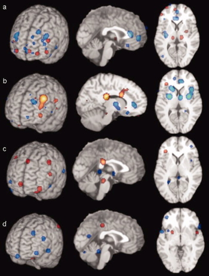
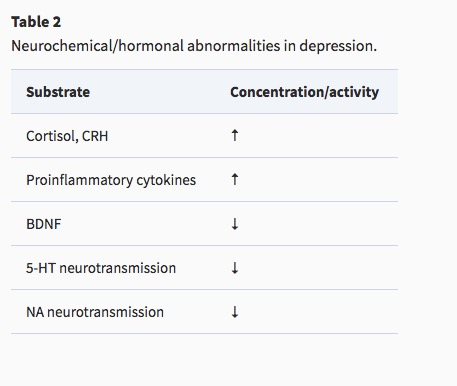

# Depression

## Symptoms

+ Unhappy mood, insomnia, lethargy, loss of pleasure, interest, energy
- Agitation
- Lasting for several weeks or more

[[@mahar_stress_2014]](http://doi.org/10.1016/j.neubiorev.2013.11.009)

## Prevalence

- Experienced by ~7% Americans in any year
- Up to ~28% lifetime risk [[@Vandeleur2017-ha]](http://dx.doi.org/10.1016/j.psychres.2017.01.060)
- Females (~20-25%) > males (~7-12%); [[@Wohleb2016-im]](http://dx.doi.org/10.1038/nrn.2016.69)
    - postpartum anxiety and depression in 10-20% of mothers [[@Pawluski2017-dy]](http://dx.doi.org/10.1016/j.tins.2016.11.009)
- [National Survey on Drug Use and Health (NSDUH)](https://www.samhsa.gov/data/report/2017-methodological-summary-and-definitions) 2017 data

https://www.nimh.nih.gov/health/statistics/major-depression.shtml

https://www.nimh.nih.gov/health/statistics/major-depression.shtml

## Genetic risk

[[@Sullivan2000-no]](http://dx.doi.org/10.1176/appi.ajp.157.10.1552)

## Neurobiology of Major Depressive Disorder (MDD)

### Reduced sizes of brain regions

- Reduced hippocampal volumes

Left Hippocampus

[[@Videbech2004-sm]](http://ajp.psychiatryonline.org/doi/abs/10.1176/appi.ajp.161.11.1957)

Right Hippocampus

[[@Videbech2004-sm]](http://ajp.psychiatryonline.org/doi/abs/10.1176/appi.ajp.161.11.1957)

[[@Palazidou2012-je]](http://dx.doi.org/10.1093/bmb/lds004)

<!-- Areas of the brain whose sizes are altered in depression -->

### Hypoactivity

+ Frontal and temporal cortex
+ Anterior cingulate
+ Insula
+ Cerebellum

[[@fitzgerald_meta-analytic_2008]](http://dx.doi.org/10.1002/hbm.20426)

> [a] patients v. ctrls, [b] patients on SSRIs, [c] patients v. ctrls (happy stim), [d] patients v. controls (sad stim)

[[@Pawluski2017-dy]](http://dx.doi.org/10.1016/j.tins.2016.11.009)

>Figure 1. Representation of Similarities and Differences in Functional Magnetic Resonance Imaging (fMRI) Activation Patterns in Key Brain Areas Associated with Postpartum Depression (PPD), Major Depressive Disorder (MDD), and Generalized Anxiety Disorder (GAD). Dots in (A) (PPD) indicate change in activation in response to infant or non-infant cues (e.g., AMG activation is increased in response to emotional infant cues, but decreased in response to emotional non-infant cues). Dots in (B) (MDD/GAD) indicate that the same brain area is activated in response to an emotional cue in both disorders (e.g., AMG activation is increased in both MDD and GAD). Brain areas highlighted have key roles in neural networks associated with stress regulation, reward, motivation, sensory processing, and executive functioning and, thus, have the capacity to affect a range of maternal activities. For example, prefrontal cortical areas (DMPFC, DLPFC, OFC, IFG, and SFG) have important roles in executive functioning and self regulation; the IC is critical for emotional processing, cognition and perception; the limbic system (ACC, PCC, HPC, and AMG) is well known for its role in stress regulation, emotion, cognition, motivation, and social responding; the striatum (STR, NaCC, and CN), VTA, and SN are key for learned reinforcement processing; and the PAG and THAL have key roles in sensory processing (reviewed in 30, 47, 149, 150). Abbreviations: ACC, anterior cingulate cortex; AMG, amygdala; CN, caudate nucleus; DLPFC, dorsal lateral prefrontal cortex; DMPFC, dorsal medial prefrontal cortex; HPC, hippocampus; IC, insular cortex; IFG, inferior frontal gyrus; NaCC, nucleus accumbens; OFC, orbital frontal cortex; PAG, periaquaductal gray; PCC, posterior cingulate cortex; SFG, superior frontal gyrus; SN, substantia nigra; STR, striatum; THAL, thalamus; VTA, ventral tegmental area.

### Hyperactivity

[[@Hamilton2012-iv]](https://doi.org/10.1176/appi.ajp.2012.11071105)

- Both valence-specific and non-valence specific

[[@Hamilton2012-iv]](https://doi.org/10.1176/appi.ajp.2012.11071105)

[[@Hamilton2012-iv]](https://doi.org/10.1176/appi.ajp.2012.11071105)

## Altered connectivity

- Increased connectivity between resting state network regions and dorsal PFC [[@Sheline2010-nh]](http://doi.org/10.1073/pnas.1000446107)

[[@Sheline2010-nh]](http://doi.org/10.1073/pnas.1000446107)

>CCN (yellow); precuneus, part of DMN (pink); and affective division of the ACC (turquoise)

- Resting state fMRI (rsFMRI) in 421 patients with major depressive disorder and 488 control subjects.
- Reduced connectivity between orbitofrontal cortex (OFC) and other areas of the brain
- Increased connectivity between lateral PFC and other brain areas

[[@cheng_medial_2016]](http://doi.org/10.1093/brain/aww255)

[[@cheng_medial_2016]](http://doi.org/10.1093/brain/aww255)

## Summary of areas implicated

[[@Palazidou2012-je]](http://dx.doi.org/10.1093/bmb/lds004)

<!-- Summary of brain areas implicated in depression -->

## Pharmacological factors

[[@Palazidou2012-je]](http://dx.doi.org/10.1093/bmb/lds004)

<!-- Neurochemical and hormonal alterations in depression -->

- Endocrine
    + Thyroid dysfunction [[@Medici2014-pn]](http://dx.doi.org/10.1210/jc.2013-3589)
    + Altered cortisol reactivity [[@Burke2005-ya]](http://dx.doi.org/10.1016/j.psyneuen.2005.02.010)
- Brain-derived neurotrophic factor (BDNF)
- Proinflammatory cytokines
- Monoamine (5-HT and NE) hypothesis
    + More: euphoria
    + Less: depression
- Evidence for
    + Resperine (antagonist for NE & 5-HT) can cause depression
    + Low serotonin (5-HT) metabolite levels in CSF of suicidal depressives [[@samuelsson_csf_2006]](http://dx.doi.org/10.1111/j.1600-0447.2005.00639.x)
    
### Measuring 5-HT

- CSF, platelets, plasma, urine, saliva
- CSF & platelets correlate highly [[@Audhya2012-sv]](http://dx.doi.org/10.1016/j.bbagen.2012.05.012)
- But salivary 5-HT does not correlate with mood symptoms [[@Leung2018-ks]](http://dx.doi.org/10.1016/j.ymgmr.2018.03.008)

## Treatments

### Psychotherapy: Neural responses

- increased rostral anterior cingulate cortex (rACC) activation vs. decrease in healthy controls
- decreased activity in left precentral gyrus

[[@Sankar2018-yp]](http://doi.org/10.1016/j.pscychresns.2018.07.002)

> Fig. 2. Group by time interaction effects of psychological therapies. There was a significant group by time interaction in the left rostral anterior cingulate cortex, in which participants with major depression showed increased activity following psychological therapy while healthy participants showed a reduction in activity at the follow up scan. Sagittal (x), coronal (y), and axial (x) coordinates for each section are presented. Results are P < 0.05 FDR corrected.

[[@Sankar2018-yp]](http://doi.org/10.1016/j.pscychresns.2018.07.002)

> Fig. 3. Longitudinal changes following psychological therapies. There was a main effect of in the left precentral gyrus, which showed decreased activity following psychological therapy in major depression. The coronal (y) coordinate of each section is presented. There were additional regions which did not meet our threshold of 50 mm3 for significance. Results are P < 0.05 FDR corrected.

### Electroconvulsive Therapy (ECT)

- Last line of treatment for drug-resistant depression
- Electric current delivered to the brain causes 30-60s seizure.
- ECT usually done in a hospital's operating or recovery room  under general anesthesia.
- Once every 2 - 5 days for a total of 6 - 12 sessions.
- Remission rates of up to 50.9% [[@dierckx_efficacy_2012]](http://doi.org/10.1111/j.1399-5618.2012.00997.x)
- Seems to work via
    + Anticonvulsant (block Na+ channel or enhance GABA function) effects
    + Neurotrophic (stimulates neurogenesis) effects

### Drugs

- Monoamine oxidase (MAO) inhibitors
    + MAO inactivates monoamines in terminal buttons
    + MAO-I’s boost monoamine levels
- Tricyclics
    + Inhibit NE, 5-HT reuptake
    + Upregulate monoamine levels, but non-selective = side effects
- Selective Serotonin Reuptake Inhibitors (SSRIs)
    + Fluoxetine (Prozac, Paxil, Zoloft)
    + Prolong duration 5-HT in synaptic cleft
    + Also increase brain steroid production
- Serotonin/Norepinephrine Reuptake Inhibitors (SNRIs)

<iframe width="420" height="315" src="https://www.youtube.com/embed/OTZvnAF7UsA" frameborder="0" allowfullscreen></iframe>

#### Drug effectiveness

- [STAR*D trial](http://www.nimh.nih.gov/funding/clinical-research/practical/stard/allmedicationlevels.shtml)
- On SSRI for 12-14 weeks. ~1/3 achieved remission; 10-15% showed symptom reduction.
- If SSRI didn't work, could switch drugs. ~25% became symptom free.
- 16% of participants dropped out due to tolerability issues
- Took 6-7 weeks to show response

#### Who benefits from drug therapy?

- May depend on
    + Early life stress
    + Brain (amygdala) response to emotional faces [[@goldstein-piekarski_human_2016]](http://doi.org/10.1073/pnas.1606671113)
- Low-stress + low amyg reactivity -> > responding
- High stress + high amyg reactivity -> > responding

[[@goldstein-piekarski_human_2016]](http://doi.org/10.1073/pnas.1606671113)

#### Problems with monoamine hypothesis

- Too simplistic
- NE, 5-HT interact
- Drugs fast acting (min), but improvement slow (weeks)
- "No correlation between serotonin and its metabolite 5-HIAA in the cerebrospinal fluid and [11C]AZ10419369 binding measured with PET in healthy volunteers." [[@Tiger2015-dy]](http://hdl.handle.net/10616/44513)
- Monamine depletion studies...

> "*...we performed the first meta-analysis of the mood effects in ATD and APTD studies. The depletion of monoamine systems (both 5-HT and NE/DA) does not decrease mood in healthy controls. However, in healthy controls with a family history of MDD the results suggest that mood is slightly decreased...by [monoamine depletion]...*"

- Acute tryptophan depletion (ATD) targets 5-HT; phenylalanine/tyrosine depletion (APTD) targets DA; alpha-methyl-para-tyrosine (AMPT) targets NE/DA. [[@Ruhe2007-qc]](http://dx.doi.org/10.1038/sj.mp.4001949)

### Evaluating treatments

#### Ketamine, again

- Relieves depressive symptoms relatively quickly [[@Berman2000-vg]](https://www.ncbi.nlm.nih.gov/pubmed/10686270) and [[@Zarate2006-np]](http://dx.doi.org/10.1001/archpsyc.63.8.856) and [[@Corriger2019-vl]](http://dx.doi.org/10.2147/DDDT.S221437)
- Boosts synaptic spine formation [[@Li2010-ve]](http://dx.doi.org/10.1126/science.1190287) and reverses effects of induced stress
- Intranasal use [approved by FDA in 2019](https://www.fda.gov/news-events/press-announcements/fda-approves-new-nasal-spray-medication-treatment-resistant-depression-available-only-certified)

## Putative pathway of pathology

- Depression ~ chronic stress [[@mahar_stress_2014]](http://doi.org/10.1016/j.neubiorev.2013.11.009)
- Stress -> chronic HPA axis activity
- Chronic HPA activity -> neuronal atrophy in hipp & PFC
- Stress & cortisol decrease expression of brain-derived neurotrophic factor (BDNF)
- BDNF boosts neurogenesis
- SSRIs act via BDNF, as do NMDA receptor antagonists (e.g., ketamine)

[[@Duman2012-nz]](http://dx.doi.org/10.1016/j.tins.2011.11.004)

[[@Frohlich2014-tq]](http://dx.doi.org/10.1177/0269881113512909)

## Putting the pieces together

[[@Palazidou2012-je]](http://dx.doi.org/10.1093/bmb/lds004)

# The disordered mind: Take home messages

- Multi-level, multi-method, multi-variate approaches essential to understanding mental illness
- Developmental processes across the life span
- Networks all the way down...

# References
