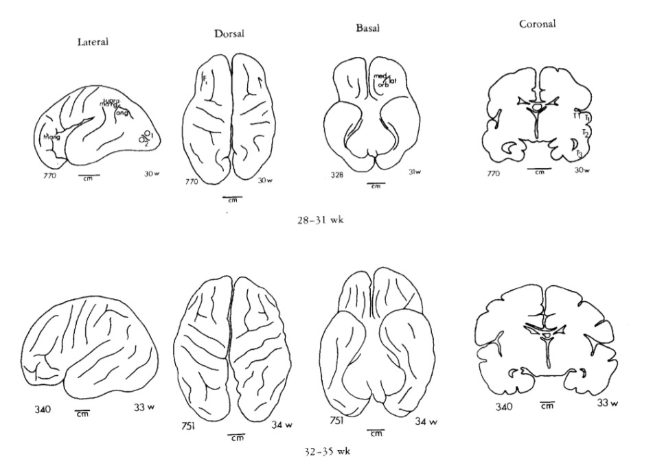
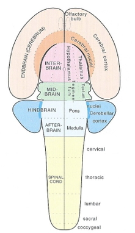

# Fun

<iframe width="560" height="315" src="https://www.youtube.com/embed/j6y1o6woVaY" frameborder="0" allowfullscreen></iframe>

<iframe width="420" height="315" src="https://www.youtube.com/embed/QMshTTIp7SA" frameborder="0" allowfullscreen></iframe>

# Evolution
## Public acceptance of evolution

<div class="figure" style="text-align: center">

<p class="caption">[[@miller2006public]](http://dx.doi.org/10.1126/science.1126746)</p>
</div>

### Types of evidence

- Fossil
    + Fossil dating
- Geological
    + Where fossils are found relative to one another
    + How long it takes to form layers
- Genetic
    + Rates of mutation
- Anatomical
    + Homologous structures across species

> *"Seen in the light of evolution, biology is, perhaps, intellectually the most satisfying and inspiring science. Without that light, it becomes a pile of sundry facts some of them interesting or curious, but making no meaningful picture as a whole."*

[[@Dobzhansky1973]](http://dx.doi.org/10.2307/4444260)

### Why Gilmore thinks the theory so controversial (in the U.S.)

- Contradicts verbatim/non-metaphorical reading of some religious texts
- Makes humans seem less special
- Time scales involved beyond human experience
- Scientific method vs. other ways of knowing
- Found in nature ≠ good for human society
- Few negative consequences of 'disbelief'
- U.S. culture individualistic, skeptical, anti-elitist, anti-intellectual
- Lower levels of religious belief among [U.S. scientists](http://news.rice.edu/2015/12/03/first-worldwide-survey-of-religion-and-science-no-not-all-scientists-are-atheists/)
- [Politics](http://www.people-press.org/2009/07/09/section-4-scientists-politics-and-religion/)
- A minority of citizens support teaching [evolution-only](http://www.pbs.org/wgbh/nova/blogs/education/2015/12/evolutionschools/) 
- Majority of classroom teachers aren't [strong advocates](https://www.sciencedaily.com/releases/2011/01/110127141657.htm)

## Evolution and development

### Ontogenesis and phylogenesis

- *Ontogenesis*
    + Development within lifetimes, history of individuals
- *Phylogenesis*
    + Change across lifestimes, history of species

#### Ontogeny does not recapitulate phylogeny ([Haeckel](https://en.wikipedia.org/wiki/Ernst_Haeckel)), but...

<div class="figure" style="text-align: center">

<p class="caption">Source: Wikipedia</p>
</div>

### Complex multicellular life emerged "recently"

<!-- History of life on Earth -->
<div class="figure" style="text-align: center">

<p class="caption">http://anthony.liekens.net/pub/timeline.png</p>
</div>

<div class="figure" style="text-align: center">

<p class="caption">Source: http://www.zo.utexas.edu/faculty/sjasper/images/26.2.gif</p>
</div>

<div class="figure" style="text-align: center">

<p class="caption">http://www.indiana.edu/~geol105b/images/gaia_chapter_6/time_scale.gif</p>
</div>

<div class="figure" style="text-align: center">

<p class="caption">http://anthony.liekens.net/pub/timeline.png</p>
</div>

### Nervous system architectures

#### How nervous systems differ

- Body symmetry
    + radial
    + bilateral
    
<div class="centered">

</div>

<div class="figure" style="text-align: center">

<p class="caption">Source: [[@arendt_nerve_2016]](https://doi.org/10.1038/nrn.2015.15)</p>
</div>

**An animal with a nerve "net"**

<iframe width="600" height="800" src="https://www.youtube.com/embed/-UI531GMRTM" frameborder="0" allowfullscreen></iframe>

- Segmentation
- Cephalization (concentration of sensory & neural structures in anterior portion of body)
- Encasement in bone (vertebrates)
- Centralized vs. distributed function

**Cephalopods have "intelligent arms"**

<iframe width="700" height="400" src="http://www.sciencedirect.com/science/article/pii/S0022098113000683" frameborder="0" allowfullscreen></iframe>

### The essentials of biological computation

- Ingestion
- Defense
- Reproduction

<div class="centered">

</div>

#### Information processing universals

- Sense/detect via sensors
  - Specialize by information source/type
  - Specialize by target location
    + Interoceptive
    + Exteroceptive
- Analyze, evaluate, decide
  - Current state
      + World
      + Organism
  - Current goals
  - Past state(s)
- Act
    + Move body
      - Approach/avoid
      - Manipulate
      - Ingest
      - Signal
    - Change physiological state

### From nerve net to nerve ring, nerve cord, and brain 
[[@arendt_nerve_2016]](http://doi.org/10.1038/nrn.2015.15)

<div class="figure" style="text-align: center">

<p class="caption">[[@arendt_nerve_2016]](http://doi.org/10.1038/nrn.2015.15)</p>
</div>

<div class="figure" style="text-align: center">

<p class="caption">[[@arendt_nerve_2016]](http://doi.org/10.1038/nrn.2015.15)</p>
</div>

- Neurons and nervous systems 520-570 M years old
- Diverse nervous systems show developmental similarities at molecular level 

### Vertebrate CNS organization

<div class="figure" style="text-align: center">

<p class="caption">http://www.bio.miami.edu/dana/pix/vertebrate_brains.jpg</p>
</div>

<div class="figure" style="text-align: center">

<p class="caption">[[@Northcutt2002-jg]](http://doi.org/10.1093/icb/42.4.743)</p>
</div>

<div class="figure" style="text-align: center">

<p class="caption">http://neurosciencelibrary.org/evolution/paleo/images/BrnBodwt6.jpg</p>
</div>

<div class="figure" style="text-align: center">

<p class="caption">[[@Northcutt2002-jg]](http://doi.org/10.1093/icb/42.4.743)</p>
</div>

<div class="figure" style="text-align: center">

<p class="caption">[[@hofman_evolution_2014]](https://doi.org/10.3389/fnana.2014.00015)</p>
</div>

| Structural measure | Non-human comparison | Human |
|--------------------|----------------------|-------|
| Cortical gray matter %/tot brain vol | insectivores 25% | 50% |
| Cortical gray + white | mice 40% | 80% |
| Cerebellar mass | primates, mammals 10-15% | 10-15% |

<div class="figure" style="text-align: center">

<p class="caption">[[@rakic2009evolution]](http://dx.doi.org/10.1038/nrn2719)</p>
</div>

<div class="figure" style="text-align: center">

<p class="caption">[[@hofman_evolution_2014]](https://doi.org/10.3389/fnana.2014.00015)</p>
</div>

**Take homes**

- Brain sizes scale with body size
- Brain sizes (more or less) scale with animal class (more or less)

**Old story**

- Within mammals, human brains bigger than expected
    - Higher *encephalization quotient* -- deviation from species-typical norm
    
<div class="figure" style="text-align: center">

<p class="caption">[[@Northcutt2002-jg]](http://doi.org/10.1093/icb/42.4.743)</p>
</div>

- Humans have larger cerebral cortical gray + white matter than comparable mammals


**vs. New story**

- Does brain size/mass matter (that much)?
- "Size matters" (brain mass) presumes similarity among brains at micro-level
- Big (large mass) brains arise in multiple animal lineages

<div class="figure" style="text-align: center">

<p class="caption">[[@Herculano-Houzel2012-up]](http://doi.org/10.1073/pnas.1201895109)</p>
</div>

- *# of cortical neurons* more important difference than brain mass
- The primate advantage -> more cortical neurons, but not larger neurons
- Human brain just scaled up (non-ape) primate brain

<div class="figure" style="text-align: center">

<p class="caption">[[@Herculano-Houzel2012-up]](http://doi.org/10.1073/pnas.1201895109)</p>
</div>

**# of cortical (or in birds, pallidum) neurons predicts "cognition"?**

<div class="figure" style="text-align: center">

<p class="caption">[[@Herculano-Houzel2017-gf]](http://doi.org/10.1016/j.cobeha.2017.02.004)</p>
</div>

**The Human Advantage [@Herculano-Houzel2016-oy]**

- More neurons in cerebral cortex than other animals, but not disproportionately so
- Less time spent foraging
    + Higher quality/more energetically dense food
    + Higher food availability
    + Cultural factors (agriculture + cooking), see also [@Wrangham2009-vq]
    
**A further human advantage**


# Human brain development

## Prenatal period

### Insemination

- 3-4 days before or up to 1-2 days after...
    + Ovulation

### Fertilization

- Within ~ 24 hrs of ovulation

### Implantation

- ~ 6 days after fertilization

### Early embryogenesis

<iframe width="560" height="315" src="https://www.youtube.com/embed/dAOWQC-OBv0" frameborder="0" allowfullscreen></iframe>

### Formation of *neural tube* (neurulation)

- Embryonic layers: ectoderm, mesoderm, endoderm
- ~18-26 days
- Failures of neural tube closure
    + Spina bifida (caudal neuraxis)
    + Anencephaly (rostral neuraxis)
- Neural tube becomes
    + Ventricles & cerebral aqueduct
    + Central canal of spinal cord

### Neurogenesis and gliogenesis

- Neuroepithelium cell layer lines neural tube
- Neural stem cells
    - Undergo *symmetric* & *asymmetric* cell division
    - Generate glia, neurons, and basal progenitor cells


<div class="figure" style="text-align: center">

<p class="caption">[[@Gotz2005-yj]](https://doi.org/10.1038/nrm1739)</p>
</div>

### Radial glia and cell migration


**Radial unit hypothesis**

<div class="figure" style="text-align: center">

<p class="caption">[[@rakic2009evolution]](http://dx.doi.org/10.1038/nrn2719)</p>
</div>


<iframe width="420" height="315" src="https://www.youtube.com/embed/ZRF-gKZHINk" frameborder="0" allowfullscreen></iframe>

<iframe width="420" height="315" src="https://www.youtube.com/embed/t-8bxeWqSV4" frameborder="0" allowfullscreen></iframe>


**Axon growth cone**

<iframe width="420" height="315" src="https://www.youtube.com/embed/Fgmt2RBow0I" frameborder="0" allowfullscreen></iframe>

- Chemoattractants
    + e.g., Nerve Growth Factor (NGF)
- Chemorepellents
- Receptors in growth cone detect chemical gradients

**Glia migrate, too**

<div class="figure" style="text-align: center">

<p class="caption">[[@Baumann2001-nw]](http://dx.doi.org/10.1152/physrev.2001.81.2.871)</p>
</div>

## Differentiation

- Neuron vs. glial cell
- Cell type
- NTs released
- Where to connect

<!-- **Differential gene expression in PFC vs. other** -->

<!-- <div class="centered"> -->
<!--  -->

<!-- [[@johnson2009functional]](http://dx.doi.org/10.1016/j.neuron.2009.03.027) -->
<!-- </div> -->

## Infancy & Early Childhood

### Synaptogenesis


### Proliferation, pruning

- Early proliferation
- Later pruning
- Rates, peaks differ by area

### Apoptosis

- Programmed cell death
- 20-80%, varies by area
- Spinal cord >> cortex
- Quantity of nerve growth factors (NGF) influences

<div class="figure" style="text-align: center">

<p class="caption">[[@rakic2009evolution]](http://dx.doi.org/10.1038/nrn2719)</p>
</div>

### Synaptic rearrangement


- Progressive phase: growth rate >> loss rate
- Regressive phase: growth rate << loss rate

### Myelination

<div class="figure" style="text-align: center">

<p class="caption">[[@Baumann2001-nw]](http://dx.doi.org/10.1152/physrev.2001.81.2.871)</p>
</div>

- Neonatal brain largely unmyelinated
- Gradual myelination, peaks in mid-20s
- Non-uniform pattern
    - Spinal cord before brain
    - Sensory before motor
    
### Gyral development

<div class="figure" style="text-align: center">

<p class="caption">[[@Chi1977-hm]](http://doi.org/10.1002/ana.410010109)</p>
</div>

<div class="figure" style="text-align: center">

<p class="caption">[[@Chi1977-hm]](http://doi.org/10.1002/ana.410010109)</p>
</div>

<div class="figure" style="text-align: center">

<p class="caption">[[@Chi1977-hm]](http://doi.org/10.1002/ana.410010109)</p>
</div>

<div class="figure" style="text-align: center">

<p class="caption">[[@Chi1977-hm]](http://doi.org/10.1002/ana.410010109)</p>
</div>

### Structural/morphometric development

<div class="centered">


[[@Knickmeyer2008-vl]](http://doi.org/10.1523/JNEUROSCI.3479-08.2008)
</div>

#### Synaptogenesis


#### Myelination across human development

<div class="figure" style="text-align: center">

<p class="caption">[[@Hagmann02112010]](http://doi.org/10.1073/pnas.1009073107)</p>
</div>

### Networks in the brain

<div class="figure" style="text-align: center">

<p class="caption">[[@irimia_2014]](http://doi.org/10.3389/fnhum.2014.00051)</p>
</div>

- Age-related functional connectivity increases within visual-related areas [[@Petrican2017-re]](http://doi.org/10.1016/j.neuroimage.2017.09.025)


<div class="figure" style="text-align: center">

<p class="caption">[[@Petrican2017-re]](http://doi.org/10.1016/j.neuroimage.2017.09.025)</p>
</div>

**"Control" networks**

<div class="figure" style="text-align: center">

<p class="caption">[[@Petrican2017-re]](http://doi.org/10.1016/j.neuroimage.2017.09.025)</p>
</div>

**non-"control" networks**

<div class="figure" style="text-align: center">

<p class="caption">[[@Petrican2017-re]](http://doi.org/10.1016/j.neuroimage.2017.09.025)</p>
</div>

**The "development" of developmental connectomics**

<div class="figure" style="text-align: center">

<p class="caption">[[@Cao2017-bl]](http://doi.org/10.1016/j.tins.2017.06.003)</p>
</div>

**Myelination changes "network" properties**

<div class="figure" style="text-align: center">

<p class="caption">[[@Hagmann02112010]](http://doi.org/10.1073/pnas.1009073107)</p>
</div>

**Synaptic rearrangment, myelination change cortical thickness**

- Cortical thickness changes [[@Gogtay2004-bq]](http://doi.org/10.1073/pnas.0402680101)

<div class="figure" style="text-align: center">

<p class="caption">[[@Shaw2008-dq]](https://doi.org/10.1523/JNEUROSCI.5309-07.2008)</p>
</div>

<div class="figure" style="text-align: center">

<p class="caption">[[@Shaw2008-dq]](https://doi.org/10.1523/JNEUROSCI.5309-07.2008)</p>
</div>

<div class="figure" style="text-align: center">

<p class="caption">[[@Shaw2008-dq]](https://doi.org/10.1523/JNEUROSCI.5309-07.2008)</p>
</div>

<div class="figure" style="text-align: center">

<p class="caption">[[@Shaw2008-dq]](https://doi.org/10.1523/JNEUROSCI.5309-07.2008)</p>
</div>

### Video depictions {.tabset}

#### Right hemisphere

<video width="320" height="240" controls>
  <source src="mov/02680Movie1.mp4" type="video/mp4">
Your browser does not support the video tag.
</video>

#### Left hemisphere

<video width="320" height="240" controls>
  <source src="mov/02680Movie2.mp4" type="video/mp4">
Your browser does not support the video tag.
</video>

#### Superior

<video width="320" height="240" controls>
  <source src="mov/02680Movie3.mp4" type="video/mp4">
Your browser does not support the video tag.
</video>

#### Inferior

<video width="320" height="240" controls>
  <source src="mov/02680Movie4.mp4" type="video/mp4">
Your browser does not support the video tag.
</video>
```

### Changes in brain energetics (glucose utilization)

<div class="figure" style="text-align: center">

<p class="caption">[[@Kuzawa2014-qd]](http://doi.org/10.1073/pnas.1323099111)</p>
</div>

### Gene expression across development

<div class="figure" style="text-align: center">

<p class="caption">[[@Kang2011-ex]](http://doi.org/10.1038/nature10523)</p>
</div>

## Summary of developmental milestones

### Prenatal

+ Neuro- and gliogenesis
+ Migration
+ Synaptogenesis begins
+ Differentiation
+ Apoptosis
+ Myelination begins
+ Infant gene expression ≠ Adult

### Postnatal

+ Synaptogenesis
+ Cortical expansion, activity-dependent change
- Then cubic, quadratic, or linear declines in cortical thickness
+ Myelination
+ Connectivity changes (esp within networks)
+ Prolonged period of postnatal/pre-reproductive development [[@konner_evolution_2011]](http://www.hup.harvard.edu/catalog.php?isbn=9780674062016)

## How brain development clarifies anatomical structure

### 3-4 weeks


<div class="figure" style="text-align: center">

<p class="caption">Source: Swanson</p>
</div>

### 4 weeks

<div class="figure" style="text-align: center">

<p class="caption">https://upload.wikimedia.org/wikipedia/commons/4/4c/4_week_embryo_brain.jpg</p>
</div>

### ~4 weeks


### 6 weeks


### Beyond 6+ weeks



### Organization of the brain

| Major division | Ventricular Landmark | Embryonic Division | Structure       |
|----------------|----------------------|--------------------|-----------------|
| Forebrain      | Lateral              | Telencephalon      | Cerebral cortex |
|                |                      |                    | Basal ganglia   |
|                |                      |                    | Hippocampus, amygdala |
|                | Third                | Diencephalon       | Thalamus        |
|                |                      |                    | Hypothalamus    |
| Midbrain       | Cerebral Aqueduct    | Mesencephalon      | Tectum, tegmentum |
| Hindbrain      | 4th                  | Metencephalon      | Cerebellum, pons  |
|                | --                   | Mylencephalon      | Medulla oblongata |

### From structural development to functional development

<div class="figure" style="text-align: center">

<p class="caption">[[@Johnson2001-yy]](http://doi.org/10.1038/35081509)</p>
</div>

# References
